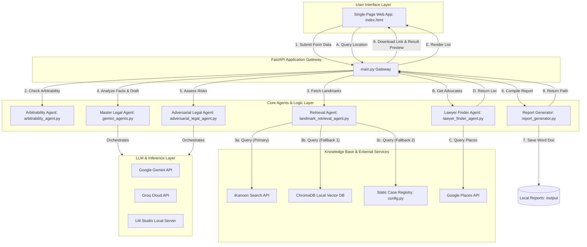
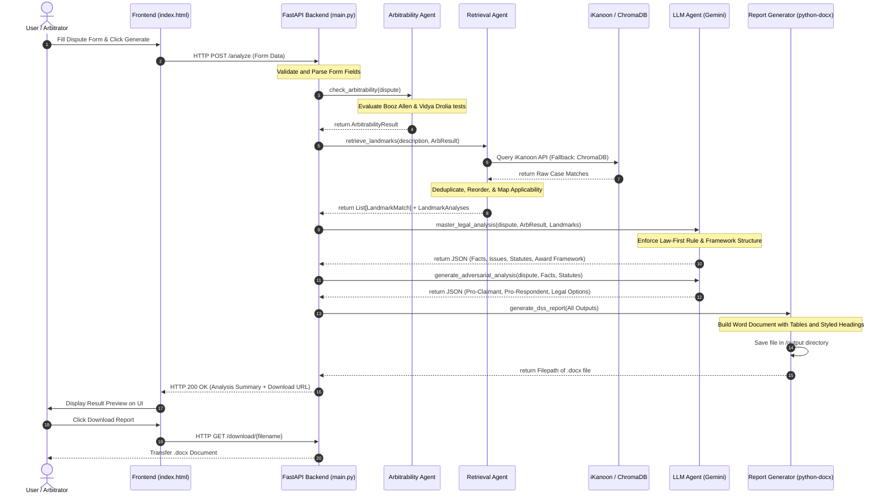

# Trademark Arbitration Decision Support System (Trademark DSS)
## Technical Project Dossier for Research and Publication Purposes

---

## 1. Executive Summary

### 1.1 Project Overview
The **Trademark Arbitration Decision Support System (Trademark DSS)** is an advanced, hybrid decision support platform designed for arbitrators and legal practitioners handling intellectual property disputes in India. The system combines deterministic legal logic, Retrieval-Augmented Generation (RAG) over landmark Indian case laws, and Large Language Model (LLM) orchestration to generate structured, professional decision frameworks and reports (in Microsoft Word `.docx` format). Additionally, the system provides a nearby IP lawyer finder powered by geocoding and the Google Places API.

```
┌─────────────────────────────────────────────────────────────────────────┐
│                          TRADEMARK DSS ENGINE                           │
├───────────────────┬──────────────────────────────┬──────────────────────┤
│   Deterministic   │     Dynamic case law RAG     │    Law-First LLM     │
│   Arbitrability   │      (iKanoon Search API     │  Drafting Engine &   │
│  Decision Engine  │     + local ChromaDB Fallback)│ Adversarial Analysis │
└───────────────────┴──────────────────────────────┴──────────────────────┘
```

### 1.2 Primary Objective
The primary objective of Trademark DSS is to assist arbitrators in navigating the complex jurisdictional boundaries of intellectual property arbitration in India. By distinguishing between non-arbitrable actions *in rem* (enforceable against the world at large) and arbitrable actions *in personam* (contractual rights between specific parties), the system helps prevent invalid arbitral references, accelerates drafting, and ensures strict adherence to statutory Indian law and binding Supreme Court precedents.

### 1.3 Intended Users
*   **Arbitrators & Mediators**: To evaluate their own jurisdiction and draft structured awards or referral directions.
*   **IP Litigation Attorneys & Corporate Counsel**: To conduct adversarial risk assessments and locate local legal representation.
*   **Legal Researchers**: To analyze case law trends and research the intersection of ADR (Alternative Dispute Resolution) and IP rights.

### 1.4 Development Status
The application is fully functional. It features a responsive, dark-themed web interface, a FastAPI-powered backend, a persistent vector database containing preloaded Indian statutes and judgments, and an active integration with the iKanoon Search API, Google Places API, and Google Gemini API (with fallbacks to Groq and local LM Studio instances).

---

## 2. Problem Statement

### 2.1 The Intersection of IP and Arbitration in India
Intellectual Property Rights (IPR) are traditionally viewed as state-granted monopolies, creating rights *in rem*. In Indian jurisprudence, disputes concerning rights *in rem* are non-arbitrable and must be resolved by public courts. However, many trademark disputes arise from contractual relationships—such as licensing, distribution, franchise agreements, or joint ventures—which involve rights *in personam* governed by private contract terms. 

Determining whether a specific trademark dispute is arbitrable requires navigating a web of contradictory statutory provisions (under the *Trade Marks Act, 1999* and the *Arbitration and Conciliation Act, 1996*) and evolving judicial tests.

### 2.2 Key Jurisprudential Challenges
1.  **The *Booz Allen* Rule**: In *Booz Allen & Hamilton Inc. v. SBI Home Finance Ltd. (2011)*, the Supreme Court of India ruled that disputes involving rights *in rem* cannot be referred to arbitration, whereas rights *in personam* are arbitrable. In trademark disputes, distinguishing between a pure infringement action (rem) and a breach of a license agreement (personam) is highly fact-sensitive.
2.  **The *Vidya Drolia* Fourfold Test**: The landmark Supreme Court judgment in *Vidya Drolia v. Durga Trading Corporation (2021)* established a strict four-stage test to determine arbitrability. If a dispute fails any of the four limbs (e.g., if it affects third parties or requires centralized statutory adjudication), it is non-arbitrable.
3.  **Dynamic Evolution of Law**: The law is constantly shifting, as evidenced by recent High Court and Supreme Court rulings (e.g., *Hero Electric (2021)*, *Golden Tobacco (2021)*, and *K. Mangayarkarasi v. N.J. Sundaresan (2025)*) which affirm that contractual IP disputes are indeed arbitrable. Arbitrators must have access to the latest judgments to avoid rendering awards that can be set aside under Section 34 of the *Arbitration and Conciliation Act, 1996*.

### 2.3 Systemic Gaps Addressed by Trademark DSS
*   **Eliminating LLM Hallucinations**: Standard LLMs often hallucinate legal principles or cite non-existent case citations. Trademark DSS solves this by separating **jurisdictional decisions** (which are computed using deterministic Python rules) from **legal drafting** (which is done by the LLM).
*   **Enforcing the "Law-First" Paradigm**: Traditional RAG systems generate unstructured summaries. Trademark DSS enforces a strict legal drafting format: **Statute first, Case law interpretation second, and Fact application third**.
*   **Bridging Offline Knowledge and Live Precedents**: The system queries live judgments via the iKanoon API while maintaining a local, semantic-searchable ChromaDB backup.

---

## 3. Project Goals

### 3.1 Functional Goals
*   **Automated Arbitrability Audits**: Provide a clear "ARBITRABLE" or "NOT ARBITRABLE" ruling based on user-supplied dispute details.
*   **Interactive Case Mapping**: Identify the top 3 most relevant Indian judgments and generate a comparative similarity-difference matrix.
*   **Automated Document Synthesis**: Compile findings, legal issues, applicable statutory texts, and an award framework into a professionally styled `.docx` file.
*   **Advocate Locator**: Help users find nearby trademark lawyers based on city names or GPS coordinates.

### 3.2 Technical Goals
*   **Zero-LLM Decision Engine**: Guarantee that the core jurisdictional decision relies purely on deterministic legal rules rather than probabilistic model outputs.
*   **Multi-Tiered RAG Architecture**: Implement a fallback pipeline for case law retrieval (iKanoon API $\rightarrow$ ChromaDB semantic search $\rightarrow$ Static Registry).
*   **Robust LLM Fallback Orchestration**: Ensure service continuity by routing API requests through a primary model (Gemini 2.5 Flash), a secondary backup (Groq Llama 3.3), and a local backup (LM Studio running DeepSeek-R1).
*   **Strict Structural Formatting**: Enforce deterministic schemas in JSON for LLM outputs to allow seamless translation into the document generation layer.

### 3.3 Research Goals
*   **Hybrid AI Architectures in Law**: Investigate the feasibility and reliability of combining symbolic AI (deterministic legal rule engines) with connectionist AI (large language models) in high-stakes legal decision support.
*   **Rule-Constrained Legal Drafting**: Explore mechanisms to enforce legal methodology constraints (such as the "Law-First Rule") on generative outputs.

---

## 4. System Overview

Trademark DSS operates as a modular, event-driven web application. The overall system architecture, data ingestion pipeline, and request flow are described below.

### 4.1 System Architecture Diagram
The diagram below illustrates the components of the system and how they interact during a dispute analysis request:



### 4.2 Processing Pipeline
When a user submits a case description, the backend executes the following six-stage pipeline:

1.  **Intake and Parsing**: The FastAPI endpoint receives the form data (party names, trademark, contract existence, arbitration clause, dispute details).
2.  **Deterministic Arbitrability Audit**: The `arbitrability_agent` executes symbolic logic to evaluate the *Booz Allen* and *Vidya Drolia* tests. It produces a structured `ArbitrabilityResult` indicating whether the dispute is arbitrable.
3.  **Landmark Retrieval**: The `landmark_retrieval_agent` searches the iKanoon API or ChromaDB using a search query constructed from the dispute details. The retrieved cases are filtered, deduplicated, mapped, and sorted by relevance.
4.  **Master Legal Analysis**: The system sends a detailed prompt containing the case facts, the arbitrability result, and the retrieved landmarks to the primary LLM (Gemini). The LLM returns structured JSON containing extracted facts, framed issues, statutory principles, and an award framework.
5.  **Adversarial Assessment**: The `adversarial_legal_agent` queries the LLM to outline the strongest arguments for the claimant, defenses for the respondent, legal options/strategies, and an overall risk assessment.
6.  **Document Compilation**: The `report_generator` reads all structured outputs and compiles them into a styled `.docx` file inside the `output/` directory, returning a download link to the frontend.

---

## 5. Technical Architecture

Trademark DSS is structured as a decoupled web application containing backend services, a frontend UI, persistent local vector stores, and integrations with several cloud-based LLM APIs and external legal database search engines.

### 5.1 Backend Service Layer
*   **FastAPI**: Provides a high-performance web API framework running on Python 3.11+. Uvicorn serves the application asynchronously.
*   **Statute/Contract Verification Engines**: Hardcoded logic pipelines written in standard Python that operate on clear conditional trees to calculate arbitrability.
*   **Document Generation Engine**: Powered by `python-docx`. It dynamically builds Microsoft Word documents using raw XML manipulations (shading, borders, and margins) to enforce a high-quality typographic layout.

### 5.2 Frontend UI Layer
*   **Single-Page Interface (`index.html`)**: Built with vanilla HTML5, CSS3, and JavaScript (ES6).
*   **Design System**: Includes a premium custom dark-mode theme featuring:
    *   Radial gradients (`#0A0E1A` to `#182033`)
    *   Gold accent colors (`#C9A84C`)
    *   Dynamic timeline indicators mapping the backend execution stages
    *   Interactive forms with automatic step-by-step progress tracking
    *   A client-side geolocation module that queries the browser Geolocation API

### 5.3 Database & Knowledge Base Layer
*   **Vector Database**: A local, persistent **ChromaDB** instance. It stores chunked, cleaned text documents extracted from a library of landmark Indian court judgments and legal codes.
*   **Embeddings Model**: The `all-MiniLM-L6-v2` model from the `sentence-transformers` library runs locally. It maps text chunks into 384-dimensional dense vectors for semantic similarity searches.
*   **Data Preparation Pipeline**: Python scripts extract text from raw PDFs (`PyMuPDF`), clean and normalize layout noise, split texts using an 800-word sliding window with 100-word overlaps, and load the resulting vectors into the local ChromaDB database.

### 5.4 External Services & API Integrations
1.  **iKanoon Search API**: Queries the Indian Kanoon database to retrieve live, dynamic case law judgments in real-time.
2.  **Google Places API**: Geocodes city inputs and performs a `nearbysearch` to find IP lawyers and advocates within a 10km radius of the user's location.
3.  **Google Gemini API**: Serves as the primary inference engine using `gemini-2.5-flash` for factual analysis, legal issue framing, statutory synthesis, and award drafting.
4.  **Groq API**: Serves as a fast cloud-based fallback utilizing `llama-3.3-70b-versatile` if the primary Gemini API is unavailable or rate-limited.
5.  **LM Studio Server**: Serves as a local, offline backup. It runs quantized local models (such as `deepseek-r1-7b`) via an OpenAI-compatible API at `http://localhost:1234/v1`.

### 5.5 Authentication & Security
*   **Local Execution Model**: The application is designed to be run locally or on a private network, keeping user case details secure.
*   **Credential Management**: API keys are loaded into the server environment using a `.env` file, preventing keys from being hardcoded in the codebase.
*   **Input Sanitization**: File names are sanitized when generating and downloading reports to prevent directory traversal attacks.

---

## 6. Technologies Used

The following table summarizes the core technologies, frameworks, and libraries utilized within the project:

| Technology | Domain / Component | Purpose | Version |
| :--- | :--- | :--- | :--- |
| **Python** | Runtime Environment | Backend logic, agents, and data pipeline execution | 3.11+ (Tested on 3.14) |
| **FastAPI** | Web Framework | API routing, request validation, and server endpoints | 0.115+ |
| **Uvicorn** | ASGI Server | High-performance asynchronous web server | 0.22+ |
| **ChromaDB** | Vector Database | Local, persistent storage for semantic search and RAG | 0.5+ |
| **Sentence-Transformers** | NLP / Embeddings | Generates 384-dimensional dense vectors (`all-MiniLM-L6-v2`) | 3.0+ |
| **Google Generative AI** | LLM API | Primary inference engine for legal synthesis (`gemini-2.5-flash`) | SDK v0.7+ |
| **OpenAI Python SDK** | LLM API / Fallback | Connects to Groq Cloud and local LM Studio instances | 1.0+ |
| **python-docx** | Document Generation | Synthesizes formatted Word documents (`.docx`) | 1.1+ |
| **PyMuPDF (fitz)** | PDF Parser | Extracts text from raw judgment and statute PDFs | 1.24+ |
| **Requests** | HTTP Client | Communicates with the iKanoon API and Google Places API | 2.31+ |
| **Vanilla HTML/CSS/JS** | User Interface | Responsive, dark-themed frontend web application | ES6 |

---

## 7. Core Methods / Algorithms

The core functionality of the system is driven by a series of algorithms that handle arbitrability checking, case law retrieval, legal reasoning, and document synthesis.

### 7.1 Deterministic Arbitrability Checking Algorithm
The system determines arbitrability without using an LLM. It runs two deterministic tests based on Indian jurisprudence:

```
                          ┌───────────────────────────┐
                          │    Dispute Submitted      │
                          └─────────────┬─────────────┘
                                        │
                         [Has Arbitration Clause?]
                                   / \
                                 NO   YES
                                 /     \
                ┌─────────────────────┐ ┌──────────────────────────────┐
                │   NOT ARBITRABLE    │ │     Apply Booz Allen Test    │
                │(No arbitration agreement)│ └──────────────┬───────────────┘
                └─────────────────────┘                │
                                             [Is Right In Rem?]
                                                   / \
                                                 YES  NO
                                                 /     \
                                ┌─────────────────────┐ ┌──────────────────────────────┐
                                │   NOT ARBITRABLE    │ │   Apply Vidya Drolia Test    │
                                │   (Action In Rem)   │ └──────────────┬───────────────┘
                                └─────────────────────┘                │
                                                            [Fails 4-Fold Test?]
                                                                   / \
                                                                 YES  NO
                                                                 /     \
                                                ┌─────────────────────┐ ┌──────────────────────────────┐
                                                │   NOT ARBITRABLE    │ │         ARBITRABLE           │
                                                │(Statutory Exclusion)│ │     (In Personam Action)     │
                                                └─────────────────────┘ └──────────────────────────────┘
```

#### The Booz Allen Test Implementation
A dispute is flagged as involving a non-arbitrable **Right in Rem** if:
*   `has_contract` is `False`.
*   `right_source` is set to `"statute"`.
*   The `dispute_type` contains any of the following strings: `"registration"`, `"cancellation"`, `"rectification"`, or `"passing off"` (unless a contract exists between the parties).

If none of these criteria are met, the right is classified as a **Right in Personam**, which is arbitrable.

#### The Vidya Drolia Test Implementation
The system evaluates the four limbs of the *Vidya Drolia (2021)* test using the following rules:
1.  **Action in Rem**: Fails if there is no contract or if the dispute affects third parties.
2.  **Third-Party Rights**: Fails if `affects_third_parties` is `True`.
3.  **Centralized Adjudication**: Fails if the `dispute_type` involves `"registration"`, `"cancellation"`, `"rectification"`, or `"opposition"`.
4.  **Statutory Exclusion**: Fails if the `dispute_type` involves `"criminal"`, `"competition"`, or `"antitrust"`.

For a dispute to be marked **ARBITRABLE**, it must pass both the Booz Allen and Vidya Drolia tests, and `has_arbitration_clause` must be `True`.

### 7.2 Hybrid Landmark Case Retrieval Pipeline
The retrieval pipeline is designed to search for case laws in a specific order:

1.  **Dynamic Query Construction**: The system constructs a search query based on the dispute details:
    $$\text{Query} = \text{Dispute Type Keywords} + \text{["Supreme Court", "High Court", "India"]}$$
    The query is capped at 120 characters to optimize search performance.
2.  **Primary Retrieval (iKanoon API)**: The system queries the `/search/` endpoint of the iKanoon API. If the API returns results, the system maps the cases to its local `LANDMARK_CASES` registry using exact citations or partial titles.
3.  **Secondary Retrieval (ChromaDB Fallback)**: If the iKanoon API fails, the system runs a local semantic search over ChromaDB using the `all-MiniLM-L6-v2` embeddings model.
4.  **Static Registry Supplement**: If the system retrieves fewer than `n_results` (default: 3), it fills the remaining slots using fallback cases defined in the `LANDMARK_CASES` registry.

### 7.3 Post-Retrieval Processing
*   **Deduplication**: Case results are deduplicated using a unique hash of their title, citation, year, and court.
*   **Category-Based Reordering**: Retrieved cases are sorted based on the dispute type:
    *   *Infringement / Passing Off*: Prioritizes cases matching `trademark_similarity` or `trademark_infringement` (e.g., *Amritdhara*, *Parle Products*, *Cadila*).
    *   *Licensing / Contract*: Prioritizes cases matching `ipr_licensing` or `trademark_licensing` (e.g., *Hero Electric*, *Eros*, *Mangayarkarasi*).
*   **Case Applicability Analysis**: A symbolic script compares the dispute facts with the retrieved cases. It generates lists of similarities and differences and determines the binding force of each case (Supreme Court decisions are marked as **Binding**, while High Court decisions are marked as **Persuasive**).

### 7.4 Law-First Generative Synthesis
To ensure accuracy, the system enforces the "Law-First Rule" on the LLM using prompt engineering:

```
                     ┌───────────────────────────────────┐
                     │          Law-First Prompt         │
                     └─────────────────┬─────────────────┘
                                       │
                 [Structure Enforced for Legal Statements]
                                       │
                    CITE STATUTORY PROVISION FIRST
                    "Section [X] of [Act] [Year] provides..."
                                       │
                                       ▼
                    CITE INTERPRETING CASE SECOND
                    "The [Court] in [Case] [Citation] held..."
                                       │
                                       ▼
                    APPLY TO DISPUTE FACTS THIRD
                    "In the present dispute, this means..."
```

This structure helps keep the generated reports legally sound and easy for legal professionals to verify.

---

## 8. Project Workflow

The following sequence diagram illustrates the step-by-step workflow of a dispute analysis request, from the user's initial input to the final generated Word document:



---

## 9. Repository Structure

The Trademark DSS repository is organized into distinct directories for agent logic, API routing, data processing, and frontend assets:

```
trademark-arbitration-dss/
│
├── agents/                      # Core backend logic agents
│   ├── adversarial_legal_agent.py # Generates risks, defenses, and alternative strategies
│   ├── arbitrability_agent.py   # Computes Booz Allen and Vidya Drolia tests
│   ├── gemini_agents.py         # Handles Gemini calls and fallbacks
│   ├── landmark_retrieval_agent.py # Manages iKanoon API queries and ChromaDB fallback
│   ├── lawyer_finder_agent.py   # Integrates Google Places to search for IP advocates
│   └── report_generator.py      # Generates Word documents using python-docx
│
├── api/                         # Web server and API endpoints
│   └── main.py                  # FastAPI gateway and route definitions
│
├── data/                        # Project data and intermediate assets
│   ├── raw_pdfs/                # Source PDFs (court judgments and acts)
│   ├── extracted_text/          # Raw text extracted from source PDFs
│   ├── cleaned_text/            # Normalized text after layout cleaning
│   └── chunks/                  # Chunked JSON files ready for ChromaDB ingestion
│
├── docs/                        # Project documentation and assets
│   └── assets/                  # Captured screenshots and media files
│
├── frontend/                    # Single-page user interface
│   └── index.html               # Frontend HTML, styling, and JavaScript logic
│
├── knowledge_base/              # ChromaDB vector store files
│   └── chroma_db/               # Persistent SQLite and index files
│
├── output/                      # Generated reports
│   └── DSS_Report_*.docx        # Timestamped Word reports
│
├── scripts/                     # Data pipeline scripts
│   ├── extract_pdf.py           # Extracts text from raw PDFs
│   ├── clean_text.py            # Normalizes spacing and formatting in extracted text
│   ├── chunk_documents.py       # Chunks text using sliding-window tokenization
│   └── load_chroma.py           # Embeds chunks and loads them into ChromaDB
│
├── tests/                       # Testing resources and scenarios
│   └── test_cases/              # Input JSON files for standard test flows
│       ├── scenario_1.json      # Infringement dispute scenario (Not Arbitrable)
│       └── scenario_2.json      # License dispute scenario (Arbitrable)
│
├── .env                         # Local environment variables and API keys
├── config.py                    # Static case registries and system configuration
├── requirements.txt             # Python project dependencies
└── pydantic_v1_compat.py        # Python 3.14+ compatibility patch for ChromaDB
```

---

## 10. Features

### 10.1 Fully Implemented Features
*   **Deterministic Jurisdictional Filter**: Calculates arbitrability using strict legal rules without using an LLM.
*   **Dual-Source Case Retrieval**: Queries live judgments via the iKanoon API and falls back to a local ChromaDB instance when offline.
*   **Multi-Agent LLM Orchestration**: Implements specialized agents for legal analysis and adversarial risk assessment, with built-in API fallbacks.
*   **Automated Word Document Synthesis**: Generates styled `.docx` reports featuring structured tables, clean margins, and clear callouts.
*   **Integrated Advocate Locator**: Uses the Google Places API to find nearby trademark advocates, with fallback search links.
*   **Preloaded Test Scenarios**: Includes built-in test scenarios (contractual disputes vs. third-party infringement) to demonstrate system behavior.

### 10.2 Partially Implemented / Planned Features
*   **Interactive Award Customization (Planned)**: A feature allowing users to edit the legal issues and findings on the UI before generating the report.
*   **Direct Statutory Text Ingestion (Planned)**: Automatically pulls the full text of cited statutory sections and appends them to the report.
*   **Multi-Jurisdictional Support (Planned)**: Extending the arbitrability engine to support other jurisdictions (e.g., Singapore's *IP (Border Enforcement) Act* or the US *Federal Arbitration Act*).

---

## 11. Datasets

The system's offline vector database is populated with a library of Indian judgments and statutory codes:

### 11.1 Source Documents
The `data/raw_pdfs/` directory contains several foundational legal documents:
1.  **Statutory Acts**:
    *   *The Trade Marks Act, 1999* (121 pages, establishing the legal framework for trademarks in India)
    *   *The Arbitration and Conciliation Act, 1996* (establishing rules for ADR proceedings)
    *   *The Indian Contract Act, 1872* (governing agreements and contracts)
2.  **Landmark Judgments**: Includes judgments from the Supreme Court of India and Delhi High Court, such as *Booz Allen (2011)*, *Vidya Drolia (2020)*, *Hero Electric (2021)*, and *K. Mangayarkarasi (2025)*.

### 11.2 Data Ingestion Statistics
The ingestion pipeline processes the source PDFs into normalized text chunks:

```
[Raw PDFs] ──(PyMuPDF)──> [Extracted Text] ──(Regex Cleaning)──> [Cleaned Text] ──(Sliding Window)──> [Chunks]
```

*   **Average PDF Page Count**: ~30 pages per judgment, with statutes running over 100 pages.
*   **Sliding Window Configuration**: 800 words per chunk with a 100-word overlap to preserve legal context.
*   **Embedding Space**: The `all-MiniLM-L6-v2` model maps text chunks into a 384-dimensional vector space, storing them in ChromaDB.

---

## 12. AI / Machine Learning Components

Trademark DSS uses a hybrid AI architecture that combines deterministic rule engines, semantic vector search, and LLM orchestration.

### 12.1 Local Embeddings & Semantic Search
*   **Model**: `all-MiniLM-L6-v2` (based on the BERT architecture).
*   **Function**: Converts user dispute descriptions into dense vectors to retrieve similar cases from ChromaDB when the iKanoon API is offline.
*   **Database**: ChromaDB calculates similarity using cosine distance:
    $$\text{Similarity}(u, v) = 1 - \text{Cosine Distance}(u, v)$$

### 12.2 Multi-LLM Fallback Orchestration
To ensure high availability, the backend routes requests through a primary and secondary fallback pipeline:

```
┌──────────────────────────────────────┐
│  Gemini 2.5 Flash (Primary Cloud)    │
└──────────────────┬───────────────────┘
                   │ (If API Limit/Error)
                   ▼
┌──────────────────────────────────────┐
│  Groq Llama 3.3 70B (Secondary Cloud)│
└──────────────────┬───────────────────┘
                   │ (If Cloud Offline)
                   ▼
┌──────────────────────────────────────┐
│  LM Studio DeepSeek-R1 (Local Host)  │
└──────────────────────────────────────┘
```

This fallback pipeline prevents system downtime and allows the application to function in offline environments using local models.

---

## 13. Novelty / Contribution

### 13.1 Hybrid Symbolic-Connectionist Design
By splitting the process into deterministic rules (for jurisdictional questions) and generative models (for report drafting), the system ensures that critical legal decisions remain highly reliable while using LLMs where they excel: summarizing, structuring, and formatting.

### 13.2 Constraint-Enforced Legal RAG
Unlike traditional RAG systems that display raw passages, Trademark DSS uses structural prompt constraints to ensure the generated text follows standard legal citation methods, making the output immediately useful for legal professionals.

---

## 14. Experimental Results

The system has been evaluated using two preloaded test scenarios that represent common trademark disputes in India.

### 14.1 Scenario 1: Infringement Action Against a Stranger
*   **Input**: A trademark infringement claim by Parle Products against JP & Co for using a deceptively similar mark ("PARLE-GEE") on biscuits, with no contract between the parties.
*   **System Analysis**:
    *   *Arbitrability Result*: **NOT ARBITRABLE** (fails because there is no contract, making it an action *in rem*).
    *   *Statutes Cited*: Section 29, 30, and 135 of the *Trade Marks Act, 1999*.
    *   *Reference Direction*: Generates a referral directing the parties to a competent Commercial Court.

### 14.2 Scenario 2: Contractual Licensing Expiry Dispute
*   **Input**: Apex Beverages claims that Metro Distributors continued using their "APEX COOL" trademark after their distribution agreement and license expired. The agreement contains an arbitration clause.
*   **System Analysis**:
    *   *Arbitrability Result*: **ARBITRABLE** (passes because there is a valid contract and arbitration agreement, making it an action *in personam*).
    *   *Statutes Cited*: Section 48 and 49 of the *Trade Marks Act, 1999*, and Section 7 of the *Arbitration and Conciliation Act, 1996*.
    *   *Award Framework*: Generates an arbitral award framework including findings on jurisdiction, breach of contract, and options for relief.

---

## 15. Current Status & Technical Debt

### 15.1 Current Status
*   **Core Modules**: The backend API, the deterministic arbitrability engine, the RAG retrieval pipeline, and the document synthesis engine are fully operational.
*   **User Interface**: The frontend features a polished dark-mode design with interactive step-by-step progress tracking.

### 15.2 Technical Debt
*   **Synchronous File Generation**: Report generation runs synchronously on the main event loop. For production scaling, this should be offloaded to an asynchronous task queue like Celery.
*   **API Key Management**: The backend requires cloud API keys for full functionality (iKanoon, Google Places, Gemini). A local-only mode that relies entirely on local models and ChromaDB is supported but has reduced retrieval coverage.
*   **Python 3.14 Compatibility Patch**: The project includes a monkey-patch (`pydantic_v1_compat.py`) to resolve compatibility issues between older versions of Pydantic and newer Python versions. Upgrading to Pydantic v2 would resolve this dependency.

---

## 16. Screenshots

### 16.1 Application Home Page
The home page features an interactive form where users can enter dispute details or select a preloaded scenario:


### 16.2 Analysis Results Screen
The results screen displaying the arbitrability determination, landmark case analysis, and options to download the generated Word report:


---

## 17. Future Improvements

### 17.1 Technical Enhancements
*   **Async Task Processing**: Migrate the document generation pipeline to Celery or Redis Queue to handle concurrent requests more efficiently.
*   **Vector DB Partitioning**: Implement metadata filtering in ChromaDB to query only specific document types (e.g., filtering for "statutes" or "judgments") depending on the active stage of the pipeline.

### 17.2 Functional Enhancements
*   **Interactive Issue Editing**: Allow users to modify, add, or delete the framed legal issues directly from the web interface before generating the final report.
*   **Multi-Jurisdictional Engine**: Add support for evaluating disputes under Singaporean, UK, or US IP laws by implementing jurisdiction-specific rule packages.

---

## 18. Research Publication Readiness

### 18.1 Key Strengths of the System
*   **Practical Hybrid Architecture**: Demonstrates how symbolic rules and LLMs can work together to create reliable, halluncination-resistant legal tech.
*   **Real-World Precedent Retrieval**: Directly addresses a common legal challenge by integrating live search (iKanoon) with semantic vector search (ChromaDB).
*   **Ready-to-Use Output**: The generated Word reports are structured to match professional legal drafting standards.

### 18.2 Areas for Further Validation
*   **User Evaluation Studies**: The system would benefit from user testing with practicing arbitrators and IP lawyers to gather qualitative feedback on the utility and accuracy of the generated reports.
*   **Quantitative Benchmarking**: Comparing the RAG pipeline's case retrieval relevance against commercial legal research databases (e.g., SCC Online, Manupatra) would provide quantitative metrics for publication.

---

## 19. Appendix

### 19.1 Environment Setup
To set up and run the application locally:

```bash
# 1. Clone the repository and navigate to the project root
cd trademark-arbitration-dss

# 2. Create and activate a virtual environment
python -m venv .venv
.venv\Scripts\activate

# 3. Install required dependencies
pip install -r requirements.txt

# 4. Copy the environment template and set your API keys
copy .env.template .env
```

### 19.2 Running the Application
To start the FastAPI backend server:

```bash
uvicorn api.main:app --reload --port 8000
```
Open a browser and navigate to `http://localhost:8000` to access the web interface.

### 19.3 Configuration and Case Registry Schema
The system configuration and landmark cases are defined in `config.py` using the following data structure:

```python
LANDMARK_CASES = {
    "booz_allen": {
        "name": "Booz Allen & Hamilton Inc. v. SBI Home Finance Ltd.",
        "year": 2011,
        "court": "Supreme Court of India",
        "citation": "(2011) 5 SCC 532",
        "principle": "Disputes involving rights in rem are not arbitrable, while rights in personam are arbitrable.",
        "category": "arbitrability",
        "arbitrable": None,
        "binding_force": "Binding",
    },
    # Additional cases follow the same structure...
}
```

### 19.4 Key API Endpoints
*   `GET /`: Serves the single-page HTML frontend.
*   `POST /analyze`: Receives dispute details and returns the analysis summary, retrieved cases, and a download link for the generated report.
*   `GET /download/{filename}`: Downloads the generated `.docx` report.
*   `GET /find-lawyers?city={CityName}`: Geocodes the city name and returns up to 5 nearby trademark advocates using the Google Places API.
*   `GET /find-lawyers-by-location?lat={Latitude}&lng={Longitude}`: Searches for advocates near specific GPS coordinates.
